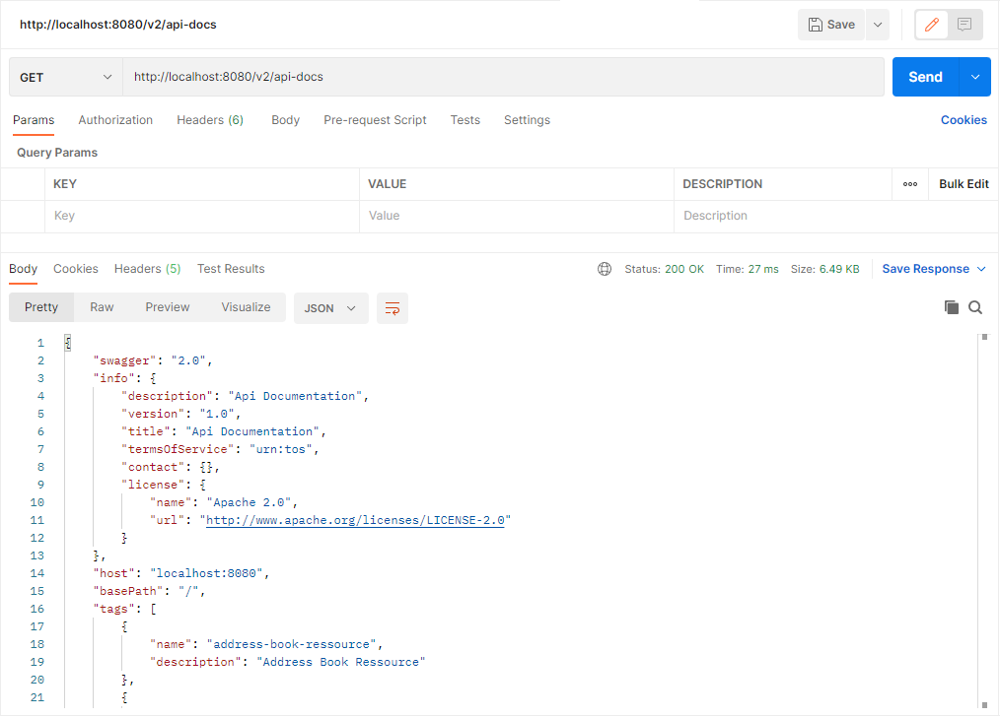
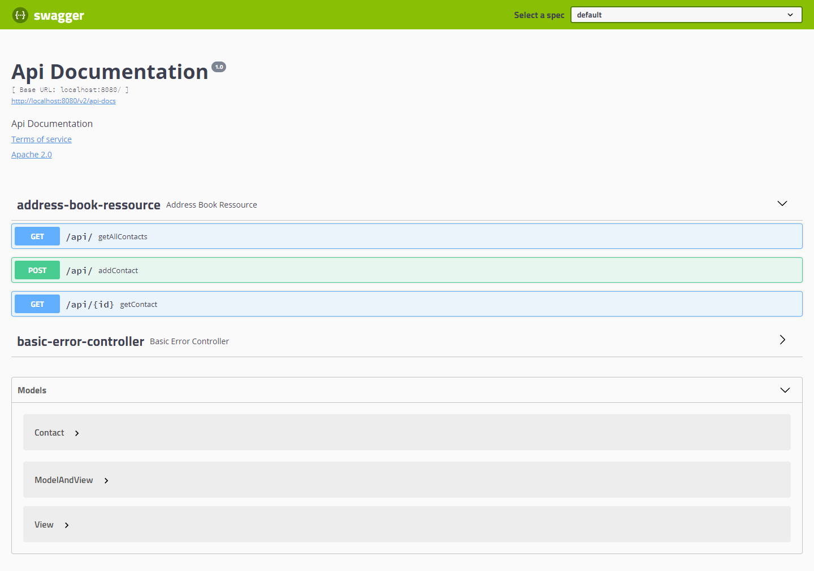

# Web Service Demo with Swagger

> 🚨 **Projet déplacer ici ▶▶ : [https://github.com/2023-esiee-projectlab/M2_web_service_swagger](https://github.com/2023-esiee-projectlab/M2_web_service_swagger)**

## Tutos ajouter Swagger

- [swagger java](https://www.google.com/search?q=swagger+java&oq=swa&aqs=chrome.3.69i57j0i67l6j46i131i199i433i465i512l2j0i67.4614j0j7&sourceid=chrome&ie=UTF-8)

- [Setting Up Swagger 2 with a Spring REST API Using Springfox](https://www.baeldung.com/swagger-2-documentation-for-spring-rest-api)
- [Tools and Integrations](https://swagger.io/tools/open-source/open-source-integrations/)
- [How to add Swagger to Spring Boot - Brain Bytes](https://www.youtube.com/watch?v=gduKpLW_vdY)

## Accès à Swagger 2

### Swagger

- Via Postman : [http://localhost:8080/v2/api-docs](http://localhost:8080/v2/api-docs)

### Swagger UI

- Via le navigateur web [http://localhost:8080/swagger-ui.html](http://localhost:8080/swagger-ui.html)

